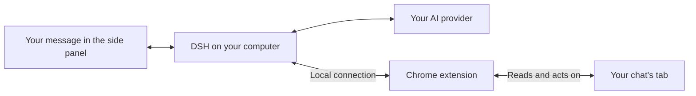

# dsh Browser Agent [](https://dshfind.com/en/plugins/jaibhasin/dsh-browser-agent?ref=badge)

An AI agent in Chrome's side panel, right beside the page you're on.
Ask it to explain something you're reading, fill out a form, or help you find your way around a website.
You can watch its steps in the chat and keep browsing while it works.

It works with the tabs you already have open, including sites where you're signed in.
[DeepSeek Harness (DSH)](https://github.com/deepseek-ai/deepseek-harness) runs on your computer and connects it to the AI model you choose.

## Quick installation

You'll need [Chrome](https://www.google.com/chrome/), [Node.js 24 LTS](https://nodejs.org/), and an API key for your chosen AI provider.
Reopen your terminal after installing Node.js.

**1. Run the installer.** It sets up DSH and prepares the Chrome extension.

macOS / Linux (desktop):

```sh
curl -fsSL https://raw.githubusercontent.com/jaibhasin/dsh-browser-agent/main/scripts/install.sh | bash
```

Windows (PowerShell 5.1+):

```powershell
$script = Join-Path $env:TEMP 'dsh-browser-install.ps1'
Invoke-WebRequest -UseBasicParsing https://raw.githubusercontent.com/jaibhasin/dsh-browser-agent/main/scripts/install.ps1 -OutFile $script
powershell -NoProfile -ExecutionPolicy Bypass -File $script
```

Wait for **Setup complete!** and keep the terminal open for the folder path and start command.

**2. Load the extension.** Open `chrome://extensions`, enable **Developer mode**, and click **Load unpacked**.
Select the extension folder printed by the installer.
If it's hidden, paste the path using Cmd+Shift+G on macOS, Ctrl+L on Linux, or the address bar on Windows.

**3. Start chatting.** Run the `node ".../start.mjs"` command printed by the installer and keep that terminal open.
Open the web address DSH prints, add your API key, and choose a model.
In Chrome, click **Extensions > dsh Browser Agent**, then try **“Summarize this page.”** on a website.

Use the same start command next time; press Ctrl+C to stop the agent.

## Agent tools

| Tool | What it does |
| --- | --- |
| `ask_user` | Asks the user for a missing choice or detail. |
| `browser_snapshot` | Reads page text and gives buttons, links, and fields numbered references. |
| `browser_navigate` | Opens an HTTP or HTTPS URL in the chat's assigned tab. |
| `browser_tabs` | Lists open browser tabs. |
| `browser_wait` | Waits for the page to settle, then takes a fresh snapshot. |
| `browser_screenshot` | Takes a PNG screenshot of the visible part of the chat's tab. |
| `browser_scroll` | Scrolls up, down, left, or right by a number of pixels. |
| `browser_click` | Clicks a button, link, or other element by its reference number. |
| `browser_type` | Types into a field by its reference number. |

Use the side panel's tool controls to disable individual agent tools for a chat.
To take a screenshot, the agent's tab needs to be visible, even if you've allowed it to work in the background.

## Tabs and chat sessions

### Each chat belongs to a tab

When you send the first message, the chat attaches to the tab you're viewing.
A blue **Agent** tab group shows you which tab it controls.
Each tab can have one chat, and the agent keeps working on that tab until you choose to move it.

Chats are saved locally with their messages, tool activity, and recent website links.
Open a saved chat and Chrome takes you back to its tab.
If you've closed the tab, the extension opens a new one at its last saved website when possible.
Unsaved page state, such as a half-filled form, isn't restored.

### When you switch tabs during work

Switch to another tab while the agent is working, and you'll get these choices:

| Choice | What happens |
| --- | --- |
| **Continue in background** | Work continues on the original assigned tab while you browse elsewhere. |
| **Pause current chat** | Work stops and the chat stays saved for later. |
| **Quit current chat** | Work stops and the chat is deleted from the extension's history. |
| **Move current chat here** | The current chat moves to the newly selected tab. |

If the tab you switch to already has a chat, you can pick up that conversation or start fresh.
Starting fresh replaces that tab's old chat in your history.
If you open another saved chat while the agent is busy, you'll also get a chance to keep the current task running, pause it, or quit it.

## What you can do

- Ask it to read a page, follow links, fill out fields, scroll, or take a screenshot.
- Run separate chats in different tabs and switch between them as you work.
- Come back to a saved chat with its messages, tool activity, and recent website links.
- Attach an image or document and ask questions about it.
- Turn individual tools on or off for each chat, with approval prompts for clicks, typing, and navigation.

Image attachments can be PNG, JPEG, WebP, or GIF.
For documents, you can attach Word, PDF, CSV, Excel, PowerPoint, OpenDocument, RTF, EPUB, Markdown, and plain text files.
Documents are converted locally before their text is sent to your model provider.

## Updates and uninstall

To update, stop DSH, run the installer again, and click the circular **Reload** button on the dsh Browser Agent card at `chrome://extensions`.
Your settings are kept, and you won't need to choose the extension folder again.

To uninstall, stop DSH and run the uninstall command printed during setup.
If you still have the downloaded project folder, open a terminal there and run:

```sh
# macOS / Linux
bash scripts/uninstall.sh
```

```powershell
# Windows
node scripts/install.mjs --uninstall
```

The uninstaller keeps a backup of the installation and its settings in folders ending in `.uninstalled-*` followed by a timestamp.
You can delete those folders once you're sure you don't need them.
They may contain private data.
Finally, remove **dsh Browser Agent** from `chrome://extensions` to delete the extension and its saved browser data.

## Troubleshooting

| What you see | What to do |
| --- | --- |
| `node` is not found | Install Node.js 24 LTS, then reopen your terminal. |
| Chrome cannot find the extension | Select the exact folder printed by the installer, including the final `extension` directory. |
| The side panel is disconnected | Start DSH with the installer-provided command and keep the terminal open. |
| Port `7331` or `3080` is already in use | Stop the other DSH instance, then start this one again. |
| Changes do not appear after an update | Restart DSH and click **Reload** on the extension card. |
| A screenshot cannot be taken | Make the chat's assigned tab visible and try again. |
| A tool fails on `chrome://` pages | Try a normal website; Chrome restricts access to internal pages. |

## How it works



Your message goes through DSH to your chosen AI model.
If the model needs to read the page or click something, it asks the extension to do that in your chat's tab.
The extension sends back the result, and the model uses it to decide what to do next.
Those steps show up in the side panel as it works.

The browser agent gets its own DSH installation and settings, so it won't replace an existing DSH setup.
Its dependencies are locked to tested versions to avoid mixing incompatible releases.

## Privacy and control

The agent uses your signed-in tabs, so a click, text entry, or form submission can affect your actual accounts.
**Approval prompts are on by default for clicks, typing, and navigation.**
Use `/human-in-the-loop` to turn them on again if you are continuing an older chat created before this setting was introduced.
You can disable individual browser tools in the chat's tool controls.

The connection between Chrome and DSH stays on your computer.
It uses a private token created during installation, and the bridge checks that connections identify themselves as coming from a Chrome extension.
Keep your installed extension, DSH settings, and backups private because they contain that token or other personal data.

Your chats are saved in Chrome on your device, and DSH also keeps local data.
The AI still needs data to work with: messages and the page content it uses go to your chosen model provider.
Screenshots and attached images may be sent there too, and can include sensitive information.
Document attachments are converted to text locally by the DSH plugin, then that text is sent to the provider.
The extension doesn't extract text from scanned PDFs using OCR or upload those PDFs.

The installer downloads the code from this repository's `main` branch.
Only run installation commands from a source you trust.

## Development

The managed installation uses DSH `0.1.2-rc.1` with a separate `dsh-browser-agent` profile.
Files live under `~/.dsh/dsh-browser-agent` by default.
Set `DSH_HOME` before installation to use another DSH data directory.
The bridge listens on `127.0.0.1:7331` and authenticates WebSocket connections with the generated token.

### Set up a checkout

Use Node.js 24 LTS and pnpm `11.8.0`, matching the project's `packageManager` setting.

```sh
git clone https://github.com/jaibhasin/dsh-browser-agent.git
cd dsh-browser-agent
npm install --global pnpm@11.8.0
pnpm install --frozen-lockfile
```

### Build and run

```sh
pnpm build:dsh-plugin
pnpm build
```

To test the complete product from your checkout, run `bash scripts/install.sh` on macOS/Linux or `powershell -NoProfile -ExecutionPolicy Bypass -File scripts/install.ps1` on Windows.
This copies your current source into the managed installation, builds both components, and configures the dedicated runtime.
Follow the printed Chrome and startup instructions.
After changing source, stop DSH, rerun the local installer, reload the extension, and restart DSH.

`pnpm dev` starts Vite for frontend development; browser integration still requires Chrome and the local DSH bridge.
The older `pnpm setup:dsh-profile` helper targets the separate `browser-agent` development profile and rewrites its configuration, so it is not the recommended installation path.
Never commit generated bridge tokens or `extension/.env.local`.

### Tests

```sh
pnpm test
```

This runs tab ownership, tab-switch state, installer ownership, recoverable uninstall, and DSH dependency consistency checks.

Run the full installer lifecycle test with internet access:

```sh
# macOS / Linux
DSH_INSTALL_E2E=1 node --test tests/install-e2e.test.mjs
```

```powershell
# Windows
$env:DSH_INSTALL_E2E = '1'
node --test tests/install-e2e.test.mjs
```

The lifecycle test uses a temporary DSH home and checks installation, updates, runtime startup, authenticated session creation, and uninstall without an API key.
The [installer compatibility workflow](.github/workflows/install.yml) runs it on macOS, Windows, and Linux with Node.js 24.

### Project layout

```text
extension/       Chrome background worker, page scripts, and React side panel
dsh-plugin/      DSH plugin, agent tools, and WebSocket server
shared/          Bridge protocol and tool definitions
runtime/         Pinned DSH runtime manifest and npm lockfile
scripts/         Installers, uninstaller, and profile setup helper
tests/           Browser state and installer tests
```

## License

[MIT](LICENSE) - Copyright (c) 2026 Jai Bhasin.
