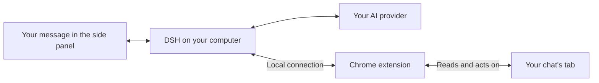

# DSH Browser Agent

Chat with an AI assistant while you browse.
Ask it to explain a page, fill out a form, or help you work through a website.

DSH Browser Agent lives in Chrome's side panel and works with the tabs you already have open, including sites where you're signed in.
[DeepSeek Harness (DSH)](https://github.com/deepseek-ai/deepseek-harness) runs on your computer and connects the assistant to your chosen AI model.

[View DSH Browser Agent on dshfind](https://dshfind.com/en/plugins/jaibhasin/dsh-browser-agent)

## Features

- Read pages, click buttons, type into fields, scroll, and take screenshots.
- Attach PNG, JPEG, WebP, or GIF images to ask the agent about visual content.
- Attach Word, PDF, CSV, Excel, PowerPoint, OpenDocument, RTF, EPUB, Markdown, and text files for local conversion and analysis.
- Watch the agent's actions as it works, right in the chat.
- Pick up a saved conversation with its messages and website links.
- Switch tabs and choose whether the agent keeps working, pauses, or follows you.
- Turn agent tools on or off for each chat.
- Use `/human-in-the-loop` to ask for approval before clicks and navigation.
- Install on macOS, Windows, or Linux without setting up DSH yourself.

## Demo

*Demo GIF coming soon.*

<!-- Replace the placeholder above with:  -->

## Quick installation

### 1. Before you start

Install [Google Chrome](https://www.google.com/chrome/) and [Node.js 24 LTS](https://nodejs.org/).
Node.js runs the local part of the assistant.
You'll also need an API key from the AI provider you want to use; you'll add it when you first open DSH.
After installing Node.js, close and reopen your terminal.
Windows users need PowerShell 5.1 or newer; Linux users need a desktop environment to use Chrome.

The installer takes care of DSH and the other tools it needs.

### 2. Run the installer

**macOS or Linux:** open Terminal and paste:

```sh
curl -fsSL https://raw.githubusercontent.com/jaibhasin/dsh-browser-agent/main/scripts/install.sh | bash
```

**Windows:** open PowerShell and paste:

```powershell
$script = Join-Path $env:TEMP 'dsh-browser-install.ps1'
Invoke-WebRequest -UseBasicParsing https://raw.githubusercontent.com/jaibhasin/dsh-browser-agent/main/scripts/install.ps1 -OutFile $script
powershell -NoProfile -ExecutionPolicy Bypass -File $script
```

First-time installation can take a few minutes.
Wait for **Setup complete!** in the terminal.
Keep the terminal open so you can copy the folder path in the next step.

You can also [download the ZIP](https://github.com/jaibhasin/dsh-browser-agent/archive/refs/heads/main.zip) and extract it first.
Open a terminal in that folder, then run `bash scripts/install.sh` on macOS/Linux or `powershell -NoProfile -ExecutionPolicy Bypass -File scripts/install.ps1` on Windows.

### 3. Load the extension in Chrome

1. Open Chrome, paste `chrome://extensions` into the address bar, and press Enter.
2. Turn on **Developer mode** in the top-right corner.
3. Click **Load unpacked** in the top-left corner.
4. Choose the **extension folder shown in your terminal** and click **Select Folder** or **Select**.

Select the folder itself, not a file inside it.
Unless you chose a different installation location, you'll find it here:

| Platform | Extension folder |
| --- | --- |
| macOS / Linux | `~/.dsh/browser-agent-install/extension` |
| Windows | `C:\Users\YOUR_USERNAME\.dsh\browser-agent-install\extension` |

The `.dsh` folder may be hidden.
To open it in the folder selection window:

- **macOS:** press Cmd+Shift+G, paste the path, and press Return.
- **Windows:** paste the path into the address bar and press Enter.
- **Linux:** press Ctrl+L, paste the path, and press Enter.

You should now see a **DSH Agent** card on the extensions page.

### 4. Start the agent

Copy and run the `node ".../start.mjs"` command printed by the installer.
For a default installation, these commands work too:

**macOS or Linux:**

```sh
node "$HOME/.dsh/browser-agent-install/start.mjs"
```

**Windows PowerShell:**

```powershell
node "$env:USERPROFILE\.dsh\browser-agent-install\start.mjs"
```

Keep this terminal open while using the agent.
Open the web address DSH prints in the terminal, add your API key, and choose a model.
Then click Chrome's puzzle-piece **Extensions** button and choose **DSH Agent** to open the side panel.

Open a website and try: **“Summarize this page.”**

Next time, run the same start command and open the side panel.
Press Ctrl+C in the terminal to stop DSH.

### Updates and uninstall

To update, stop DSH, run the installer again, and click the circular **Reload** button on the DSH Agent card at `chrome://extensions`.
Your settings are kept, and you won't need to choose the extension folder again.

To uninstall, stop DSH and run the uninstall command printed during setup.
If you still have the downloaded project folder, open a terminal there and run:

```sh
# macOS / Linux
bash scripts/uninstall.sh
```

```powershell
# Windows
node scripts/install.mjs --uninstall
```

The uninstaller keeps a backup of the installation and its settings in folders ending in `.uninstalled-*` followed by a timestamp.
You can delete those folders once you're sure you don't need them.
They may contain private data.
Finally, remove **DSH Agent** from `chrome://extensions` to delete the extension and its saved browser data.

### Troubleshooting

| What you see | What to do |
| --- | --- |
| `node` is not found | Install Node.js 24 LTS, then reopen your terminal. |
| Chrome cannot find the extension | Select the exact folder printed by the installer, including the final `extension` directory. |
| The side panel is disconnected | Start DSH with the installer-provided command and keep the terminal open. |
| Port `7331` or `3080` is already in use | Stop the other DSH instance, then start this one again. |
| Changes do not appear after an update | Restart DSH and click **Reload** on the extension card. |
| A screenshot cannot be taken | Make the chat's assigned tab visible and try again. |
| A tool fails on `chrome://` pages | Try a normal website; Chrome restricts access to internal pages. |

## How it works



When you send a message, DSH passes it to your chosen AI model.
The model can ask the extension to read the page or take an action, such as clicking a button.
The extension carries out that action in the chat's tab and reports what happened.
You see the progress and reply in the side panel.

The browser agent gets its own DSH installation and settings, so it won't replace an existing DSH setup.
Its dependencies are locked to tested versions to avoid mixing incompatible releases.

## Agent tools

| Tool | What it does |
| --- | --- |
| `ask_user` | Asks the user for a missing choice or detail. |
| `browser_snapshot` | Reads page text and gives buttons, links, and fields numbered references. |
| `browser_navigate` | Opens an HTTP or HTTPS URL in the chat's assigned tab. |
| `browser_tabs` | Lists open browser tabs. |
| `browser_wait` | Waits for the page to settle, then takes a fresh snapshot. |
| `browser_screenshot` | Takes a PNG screenshot of the visible part of the chat's tab. |
| `browser_scroll` | Scrolls up, down, left, or right by a number of pixels. |
| `browser_click` | Clicks a button, link, or other element by its reference number. |
| `browser_type` | Types into a field by its reference number. |

Use the side panel's tool controls to disable individual agent tools for a chat.
To take a screenshot, the agent's tab needs to be visible, even if you've allowed it to work in the background.

## Tabs and chat sessions

### Each chat belongs to a tab

When you send the first message, the chat attaches to the tab you're viewing.
A blue **Agent** tab group shows you which tab it controls.
Each tab can have one chat, and the agent keeps working on that tab until you choose to move it.

Chats are saved locally with their messages, tool activity, and recent website links.
Open a saved chat and Chrome takes you back to its tab.
If you've closed the tab, the extension opens a new one at its last saved website when possible.
Unsaved page state, such as a half-filled form, isn't restored.

### When you switch tabs during work

Switch to another tab while the agent is working, and you'll get these choices:

| Choice | What happens |
| --- | --- |
| **Continue in background** | Work continues on the original assigned tab while you browse elsewhere. |
| **Pause current chat** | Work stops and the chat stays saved for later. |
| **Quit current chat** | Work stops and the chat is deleted from the extension's history. |
| **Move current chat here** | The current chat moves to the newly selected tab. |

If the tab you switch to already has a chat, you can pick up that conversation or start fresh.
Starting fresh replaces that tab's old chat in your history.
If you open another saved chat while the agent is busy, you'll also get a chance to keep the current task running, pause it, or quit it.

## Security

The connection between Chrome and DSH stays on your computer.
It uses a private token created during installation, and the bridge checks that connections identify themselves as coming from a Chrome extension.
Keep your installed extension, DSH settings, and backups private because they contain that token or other personal data.

The extension needs access to websites to read and interact with them.
Because it uses your signed-in tabs, its actions can affect your accounts.
Your chats are saved in Chrome on your device, and DSH also keeps local data.
Messages and page content used by the AI are sent to the model provider you chose.
Page text and screenshots may include sensitive information.
Images attached to chats may also be sent to the model provider you choose.
Document attachments are converted locally by the DSH plugin before their text is sent to the model provider you choose.
Scanned PDFs are not OCR'd or uploaded by this extension.

**Approval prompts are off by default.**
Type `/human-in-the-loop` in a chat to require approval before `browser_click` and `browser_navigate` calls.
Other tools don't get these approval prompts; you can turn them off using the chat's tool controls.

The installer downloads the code from this repository's `main` branch.
Only run installation commands from a source you trust.

## Development

The managed installation uses DSH `0.1.2-rc.1` with a separate `dsh-browser-agent` profile.
Files live under `~/.dsh/browser-agent-install` by default.
Set `DSH_HOME` before installation to use another DSH data directory.
The bridge listens on `127.0.0.1:7331` and authenticates WebSocket connections with the generated token.

### Set up a checkout

Use Node.js 24 LTS and pnpm `11.8.0`, matching the project's `packageManager` setting.

```sh
git clone https://github.com/jaibhasin/dsh-browser-agent.git
cd dsh-browser-agent
npm install --global pnpm@11.8.0
pnpm install --frozen-lockfile
```

### Build and run

```sh
pnpm build:dsh-plugin
pnpm build
```

To test the complete product from your checkout, run `bash scripts/install.sh` on macOS/Linux or `powershell -NoProfile -ExecutionPolicy Bypass -File scripts/install.ps1` on Windows.
This copies your current source into the managed installation, builds both components, and configures the dedicated runtime.
Follow the printed Chrome and startup instructions.
After changing source, stop DSH, rerun the local installer, reload the extension, and restart DSH.

`pnpm dev` starts Vite for frontend development; browser integration still requires Chrome and the local DSH bridge.
The older `pnpm setup:dsh-profile` helper targets the separate `browser-agent` development profile and rewrites its configuration, so it is not the recommended installation path.
Never commit generated bridge tokens or `extension/.env.local`.

### Tests

```sh
pnpm test
```

This runs tab ownership, tab-switch state, installer ownership, recoverable uninstall, and DSH dependency consistency checks.

Run the full installer lifecycle test with internet access:

```sh
# macOS / Linux
DSH_INSTALL_E2E=1 node --test tests/install-e2e.test.mjs
```

```powershell
# Windows
$env:DSH_INSTALL_E2E = '1'
node --test tests/install-e2e.test.mjs
```

The lifecycle test uses a temporary DSH home and checks installation, updates, runtime startup, authenticated session creation, and uninstall without an API key.
The [installer compatibility workflow](.github/workflows/install.yml) runs it on macOS, Windows, and Linux with Node.js 24.

### Project layout

```text
extension/       Chrome background worker, page scripts, and React side panel
dsh-plugin/      DSH plugin, agent tools, and WebSocket server
shared/          Bridge protocol and tool definitions
runtime/         Pinned DSH runtime manifest and npm lockfile
scripts/         Installers, uninstaller, and profile setup helper
tests/           Browser state and installer tests
```

## License

[MIT](LICENSE) - Copyright (c) 2026 Jai Bhasin.
