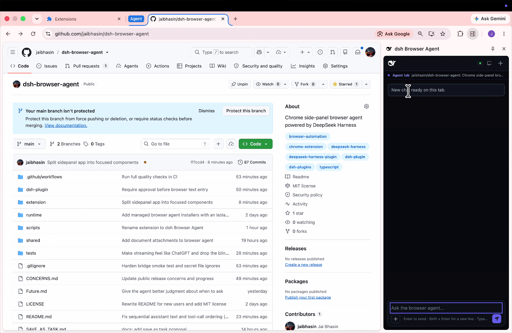
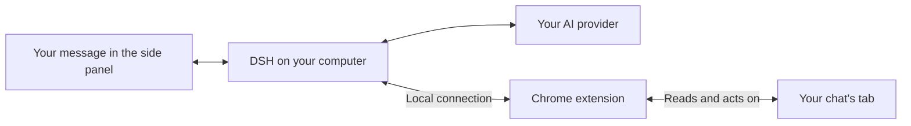

# dsh Browser Agent [](https://dshfind.com/en/plugins/jaibhasin/dsh-browser-agent?ref=badge)


  
  


A plugin for [Deepseek Harness](https://www.deepseek.com/harness/en/) which lets you control your chrome tabs simultaneously and parallelly.




It can read, write, navigate, take DOM snapshot,  screenshot, ask questions in between, scroll etc.

It can work with any LLM of your choice.

## Quick install

Standard **dsh plugin**  command won't work here. As it include both dsh bridge and browser extension.

This one line command installs the full project 

macOS / Linux:

```sh
curl -fsSL https://raw.githubusercontent.com/jaibhasin/dsh-browser-agent/main/scripts/install.sh | bash
```

Windows (PowerShell):

```powershell
$script = Join-Path $env:TEMP 'dsh-browser-install.ps1'; Invoke-WebRequest -UseBasicParsing 'https://raw.githubusercontent.com/jaibhasin/dsh-browser-agent/main/scripts/install.ps1' -OutFile $script; powershell -NoProfile -ExecutionPolicy Bypass -File $script
```

When the setup completes it prints the extension folder and start command you'll need next.

Go to `chrome://extensions`, turn on **Developer mode**, click **Load unpacked**, and select the folder the installer printed.

Run the `node ".../start.mjs"` command from the installer and keep that terminal open.


Open the web address DSH prints, add your API key, and pick a model.


Then click **Extensions > dsh Browser Agent** in Chrome and start chatting.

Use the same start command next time; Ctrl+C stops the agent.

## Agent tools

List of tools the **agent** has access to by default

| Tool | What it does |
| --- | --- |
| `ask_user` | Asks the user for a missing choice or detail. |
| `browser_snapshot` | Reads page text and gives buttons, links, and fields numbered references. |
| `browser_navigate` | Opens an HTTP or HTTPS URL in the chat's assigned tab. |
| `browser_tabs` | Lists open browser tabs. |
| `browser_wait` | Waits for the page to settle, then takes a fresh snapshot. |
| `browser_screenshot` | Takes a PNG screenshot of the visible part of the chat's tab. |
| `browser_scroll` | Scrolls up, down, left, or right by a number of pixels. |
| `browser_click` | Clicks a button, link, or other element by its reference number. |
| `browser_type` | Types into a field by its reference number. |

Type `/tools` in the extension to turn individual tools on or off.

## Tabs and chat sessions

### Each chat belongs to a tab

Each chat session can be attached to one tab and each tab can have one chat session open at a time.

You can move the chat from one tab to another and also keep the chat active in background

Closed tabs can be reopened by clicking on their chats through chat history

### When you switch tabs during work

Switch to another tab while the agent is working, and you'll get these choices:

| Choice | What happens |
| --- | --- |
| **Continue in background** | Agent continues on the original  tab while you browse elsewhere. |
| **Pause current chat** | Agent stops and the chat stays saved. |
| **Quit current chat** | Agent stops and the chat is deleted from the extension's history. |
| **Move current chat here** | Agent's session moves to the newly selected tab. |

If you switch to a tab that already has a chat session you can continue with it or start a new one

If you open another saved chat while the agent is busy, you'll also get a chance to keep the current agent running, pause it, or quit it.

When a background agent needs to ask a question or an approval, a Chrome notification lets you jump back to it.
Use `/notifications` to turn the notification sound on or off.

## What you can do

- Ask it to read a page, follow links, fill out fields, scroll, or take a screenshot.
- Run separate chats in different tabs and switch between them as you work.
- Come back to a saved chat with its messages, tool activity, and recent website links.
- Attach an image or document and ask questions about it.
- Turn individual tools on or off for each chat, with approval prompts for clicks, typing, and navigation.

Image attachments can be PNG, JPEG, WebP, or GIF.
For documents, you can attach Word, PDF, CSV, Excel, PowerPoint, OpenDocument, RTF, EPUB, Markdown, and plain text files.
Documents are converted locally before their text is sent to your model provider.

### Save something you'll do again

If a conversation gets you through a task you'll repeat, choose **Save as a task** in the chat header.
The agent drafts reusable instructions from the conversation for you to review and edit before saving.
Next time, type `/tasks`, pick the task, and fill in any details it needs for that run.
You can also find and edit your saved tasks in chat history.

### Say it instead of typing it

Click the microphone beside the message box to set up voice input.
Use browser dictation without another API key, or choose Groq, OpenRouter, Deepgram, or ElevenLabs with your own key and transcription model.
Your words go into the message box, so you can check or edit them before sending.
To change your setup later, type `/voice-config`.

## Updates and uninstall

To update, stop DSH, run the installer again, and click the circular **Reload** button on the dsh Browser Agent card at `chrome://extensions`.
Your settings are kept, and you won't need to choose the extension folder again.

To uninstall, stop DSH and run the uninstall command printed during setup.
If you still have the downloaded project folder, open a terminal there and run:

```sh
# macOS / Linux
bash scripts/uninstall.sh
```

```powershell
# Windows
node scripts/install.mjs --uninstall
```

The uninstaller keeps a backup of the installation and its settings in folders ending in `.uninstalled-*` followed by a timestamp.
You can delete those folders once you're sure you don't need them.
They may contain private data.
Finally, remove **dsh Browser Agent** from `chrome://extensions` to delete the extension and its saved browser data.

## Troubleshooting

| What you see | What to do |
| --- | --- |
| `node` is not found | Install Node.js 22.19+ (22.x) or 24+, then reopen your terminal. |
| Chrome cannot find the extension | Select the exact folder printed by the installer, including the final `extension` directory. |
| The side panel is disconnected | Start DSH with the installer-provided command and keep the terminal open. |
| Port `7331` or `3080` is already in use | Stop the other DSH instance, then start this one again. |
| Multiple Chrome profiles alternate between Live and Offline | Restart DSH and click **Reload** on the extension card in each profile so every profile uses the multi-profile bridge protocol. |
| Changes do not appear after an update | Restart DSH and click **Reload** on the extension card. |
| A screenshot cannot be taken | Make the chat's assigned tab visible and try again. |
| A tool fails on `chrome://` pages | Try a normal website; Chrome restricts access to internal pages. |

## How it works



Your message goes through DSH to your chosen AI model.
If the model needs to read the page or click something, it asks the extension to do that in your chat's tab.
The extension sends back the result, and the model uses it to decide what to do next.
Those steps show up in the side panel as it works.

The browser agent gets its own DSH installation and settings, so it won't replace an existing DSH setup.
Its dependencies are locked to tested versions to avoid mixing incompatible releases.

## Privacy and control

The agent works on your real, signed-in tabs, so its actions affect your actual accounts.
That's why approval prompts are on by default for clicks, typing, and navigation.
Use `/human-in-the-loop` to turn them off or back on for the current chat.

The connection between Chrome and DSH stays on your computer and uses a private token.
Your chats and saved tasks are stored in Chrome, and DSH keeps its own local data too.
Your chosen AI provider receives your messages and the page content the agent reads, along with any screenshots or attached images it uses.
Documents are converted to text locally before that text is sent to the provider; scanned PDFs aren't uploaded or processed with OCR.

For voice input, recordings go to the transcription provider you choose, and its API key is saved in the extension's local settings.
Browser dictation uses Chrome's speech recognition instead.
Keep your extension data, DSH settings, and installation backups private: they can contain credentials and personal information.

The installer pulls from this repo's `main` branch, so only run it from sources you trust.

## Development

The managed installation uses DSH `0.1.2-rc.1` with a separate `dsh-browser-agent` profile.
Files live under `~/.dsh/dsh-browser-agent` by default.
Set `DSH_HOME` before installation to use another DSH data directory.
The bridge listens on `127.0.0.1:7331` and authenticates WebSocket connections with the generated token.

### Set up a checkout

Use Node.js 22.19+ (22.x) or 24+, and pnpm `11.8.0`, matching the project's `packageManager` setting.

```sh
git clone https://github.com/jaibhasin/dsh-browser-agent.git
cd dsh-browser-agent
npm install --global pnpm@11.8.0
pnpm install --frozen-lockfile
```

### Build and run

```sh
pnpm build:dsh-plugin
pnpm build
```

To test the complete product from your checkout, run `bash scripts/install.sh` on macOS/Linux or `powershell -NoProfile -ExecutionPolicy Bypass -File scripts/install.ps1` on Windows.
This copies your current source into the managed installation, builds both components, and configures the dedicated runtime.
Follow the printed Chrome and startup instructions.
After changing source, stop DSH, rerun the local installer, reload the extension, and restart DSH.

`pnpm dev` starts Vite for frontend development; browser integration still requires Chrome and the local DSH bridge.
The older `pnpm setup:dsh-profile` helper targets the separate `browser-agent` development profile and rewrites its configuration, so it is not the recommended installation path.
Never commit generated bridge tokens or `extension/.env.local`.

### Tests

```sh
pnpm test
```

This checks browser session behavior, saved tasks, voice configuration, attachments, provider errors, memory benchmarks, and the installer, among other things.
It doesn't replace trying the extension in Chrome with a real model.

For the guided multi-tab memory benchmark, see the [benchmark instructions](evals/memory-benchmark/README.md).

Run the full installer lifecycle test with internet access:

```sh
# macOS / Linux
DSH_INSTALL_E2E=1 node --test tests/install-e2e.test.mjs
```

```powershell
# Windows
$env:DSH_INSTALL_E2E = '1'
node --test tests/install-e2e.test.mjs
```

The lifecycle test uses a temporary DSH home and checks installation, updates, runtime startup, authenticated session creation, and uninstall without an API key.
The [installer compatibility workflow](.github/workflows/install.yml) runs it on macOS, Windows, and Linux with Node.js 24.

### Project layout

```text
extension/       Chrome background worker, page scripts, and React side panel
dsh-plugin/      DSH plugin, agent tools, and WebSocket server
shared/          Bridge protocol and tool definitions
runtime/         Pinned DSH runtime manifest and npm lockfile
scripts/         Installers, uninstaller, and profile setup helper
tests/           Browser state and installer tests
```

## License

[MIT](LICENSE) - Copyright (c) 2026 Jai Bhasin.
