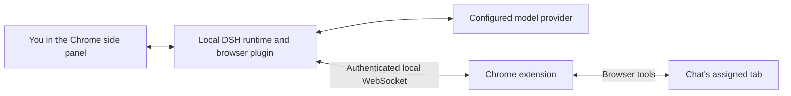

# DSH Browser Agent

An AI assistant in Chrome's side panel that can read pages, click controls, fill fields, and navigate websites for you.
Powered by [DeepSeek Harness (DSH)](https://github.com/deepseek-ai/deepseek-harness), it works in your existing browser tabs, including websites where you are already signed in.

## Features

- **Chat beside your browser.** Ask questions about a page and give the agent tasks without switching apps.
- **Read and interact with websites.** Inspect page content, navigate, click, type, scroll, and capture screenshots.
- **Follow its progress.** See tool activity and responses in the conversation.
- **Save conversations locally.** Reopen chats with their messages, tool activity, and recent website links.
- **Choose what happens when you switch tabs.** Continue in the background, pause, quit, or move the chat to another tab.
- **Control browser tools per chat.** Disable tools you do not want a conversation to use.
- **Ask before clicks and navigation.** Enable `/human-in-the-loop` in a chat for approval prompts.
- **Install on macOS, Windows, or Linux.** Use a dedicated profile and a compatible, pinned DSH runtime.

## Demo

*Demo GIF coming soon.*

<!-- Replace the placeholder above with:  -->

## Quick installation

### 1. Install the prerequisites

You need [Google Chrome](https://www.google.com/chrome/), [Node.js 24 LTS](https://nodejs.org/), and an API key for the model provider you will configure in DSH.
After installing Node.js, close and reopen your terminal.
Windows users need PowerShell 5.1 or newer; Linux users need a desktop environment to use Chrome.

You do not need to install DSH, pnpm, or Git separately.
The installer downloads the required tools and builds the extension for your device.

### 2. Run the installer

**macOS or Linux:** open Terminal and paste:

```sh
curl -fsSL https://raw.githubusercontent.com/jaibhasin/dsh-browser-agent/main/scripts/install.sh | bash
```

**Windows:** open PowerShell and paste:

```powershell
$script = Join-Path $env:TEMP 'dsh-browser-install.ps1'
Invoke-WebRequest -UseBasicParsing https://raw.githubusercontent.com/jaibhasin/dsh-browser-agent/main/scripts/install.ps1 -OutFile $script
powershell -NoProfile -ExecutionPolicy Bypass -File $script
```

First-time installation can take a few minutes.
Wait until the terminal displays **Setup complete!** and your extension folder path.

Prefer to download the files first?
[Download the repository ZIP](https://github.com/jaibhasin/dsh-browser-agent/archive/refs/heads/main.zip), extract it, open a terminal in the extracted folder, and run `bash scripts/install.sh` or `powershell -NoProfile -ExecutionPolicy Bypass -File scripts/install.ps1`.

### 3. Load the extension in Chrome

1. Open Chrome, paste `chrome://extensions` into the address bar, and press Enter.
2. Turn on **Developer mode** in the top-right corner.
3. Click **Load unpacked** in the top-left corner.
4. Select the **extension folder printed by the installer**, then confirm your selection.

Select the folder itself, not a file inside it.
With the default installation settings, its location is:

| Platform | Extension folder |
| --- | --- |
| macOS / Linux | `~/.dsh/browser-agent-install/extension` |
| Windows | `C:\Users\YOUR_USERNAME\.dsh\browser-agent-install\extension` |

If you cannot see the folder, enter its full path in the folder picker:

- **macOS:** press Cmd+Shift+G, paste the path, and press Return.
- **Windows:** paste the path into the address bar and press Enter.
- **Linux:** press Ctrl+L, paste the path, and press Enter.

You should now see a **DSH Agent** card on the extensions page.

### 4. Start the agent

Copy and run the `node ".../start.mjs"` command printed by the installer.
With the default installation settings, you can also use:

**macOS or Linux:**

```sh
node "$HOME/.dsh/browser-agent-install/start.mjs"
```

**Windows PowerShell:**

```powershell
node "$env:USERPROFILE\.dsh\browser-agent-install\start.mjs"
```

Keep this terminal open while using the agent.
Open the local web address printed by DSH, configure your API key, and select a model.
Then click Chrome's puzzle-piece **Extensions** button and choose **DSH Agent** to open the side panel.

Open a website and try: **“Summarize this page.”**

Next time, run the same start command and open the side panel.
Press Ctrl+C in the terminal to stop DSH.

### Updates and uninstall

To update, stop DSH, run the installer again, and click the circular **Reload** button on the DSH Agent card at `chrome://extensions`.
The extension stays at the same folder path, and the installer preserves your profile configuration and bridge token.

To uninstall, stop DSH and run the uninstall command printed during setup.
If you have a checkout or extracted ZIP, you can instead run:

```sh
# macOS / Linux
bash scripts/uninstall.sh
```

```powershell
# Windows
node scripts/install.mjs --uninstall
```

Uninstall moves the managed installation and its profile into timestamped `.uninstalled-*` backup folders rather than deleting them.
These backups may contain private data; delete them when you no longer need them.
Remove **DSH Agent** from `chrome://extensions` separately to remove its Chrome storage.

### Troubleshooting

| What you see | What to do |
| --- | --- |
| `node` is not found | Install Node.js 24 LTS, then reopen your terminal. |
| Chrome cannot find the extension | Select the exact folder printed by the installer, including the final `extension` directory. |
| The side panel is disconnected | Start DSH with the installer-provided command and keep the terminal open. |
| Port `7331` or `3080` is already in use | Stop the other DSH instance, then start this one again. |
| Changes do not appear after an update | Restart DSH and click **Reload** on the extension card. |
| A screenshot cannot be taken | Make the chat's assigned tab visible and try again. |
| A tool fails on `chrome://` pages | Try a normal website; Chrome restricts access to internal pages. |

## How it works



You send a message from the side panel to DSH running on your computer.
DSH asks your configured model how to proceed, and the browser plugin routes browser tool calls back to the extension.
The extension acts in the chat's assigned tab and sends results back to DSH.
Replies and tool activity appear in the side panel.

The installer uses a dedicated `browser-agent-installed` profile and its own DSH `0.1.2-rc.1` runtime.
It preserves existing profiles and uses lockfiles for the runtime and build dependencies to keep versions consistent.
Managed files live under `~/.dsh/browser-agent-install`; set `DSH_HOME` before installation to choose a different DSH data directory.

## Browser tools

| Tool | What it does |
| --- | --- |
| `browser_snapshot` | Reads structured DOM and accessibility text with references to interactive elements. |
| `browser_navigate` | Opens an HTTP or HTTPS URL in the chat's assigned tab. |
| `browser_tabs` | Lists open browser tabs. |
| `browser_wait` | Waits for the page to settle, then takes a fresh snapshot. |
| `browser_screenshot` | Captures a PNG of the assigned tab's visible viewport. |
| `browser_scroll` | Scrolls up, down, left, or right by a number of pixels. |
| `browser_click` | Clicks an element using its snapshot reference. |
| `browser_type` | Enters text into an input using its snapshot reference. |

Use the side panel's tool controls to disable individual browser tools for a chat.
Screenshots require the assigned tab to be visible, including when a task is otherwise allowed to continue in the background.

## Tabs and chat sessions

### One chat, one assigned tab

A chat is assigned to the active tab when its first message is sent.
Each tab can belong to one chat at a time, and the assigned tab is marked with a blue **Agent** tab group.
Browser actions stay on that tab until you explicitly move the chat.
Listing tabs does not transfer control to another tab.

Chats are saved locally with their messages, tool activity, and recent website links.
Opening a saved chat focuses its tab; if that tab is gone, the extension recreates it using the last saved website when available.
This reopens the website, not an exact copy of its previous page state.

### When you switch tabs during work

The side panel asks what should happen to the current task before proceeding:

| Choice | What happens |
| --- | --- |
| **Continue in background** | Work continues on the original assigned tab while you browse elsewhere. |
| **Pause current chat** | Work stops and the chat stays saved for later. |
| **Quit current chat** | Work stops and the chat is deleted from the extension's history. |
| **Move current chat here** | The current chat moves to the newly selected tab. |

If the destination tab already has a saved chat, you can continue that conversation or start a new one.
Starting a new chat on an owned tab replaces its previous chat in the extension's history.
Opening another saved chat while work is active likewise lets you continue in the background, pause, or quit the current chat first.

## Security

The browser bridge listens on `127.0.0.1:7331` and requires a shared authentication token plus a Chrome extension origin.
The installer generates the token locally and includes it in your extension build.
Treat the installed extension directory, profile, and backup folders as private; do not upload or share them.

The extension requests broad website access so it can operate on the pages you use.
It works with your existing signed-in browser session, so its actions can affect those accounts.
Chats are stored locally in Chrome, and DSH maintains its own local data.
**Local operation does not mean offline inference:** messages and browser content used in model requests are sent to your configured model provider.
Do not assume page content or screenshots are automatically stripped of sensitive information.

**Approval prompts are off by default.**
Type `/human-in-the-loop` in a chat to require approval before `browser_click` and `browser_navigate` calls.
This mode does not cover every tool; use per-chat tool controls to restrict other browser actions.

The installer downloads source from `main`, uses a dedicated runtime and profile, and refuses to overwrite directories it does not recognize as its own.
Run installation commands only from a source you trust.

## Development

### Set up a checkout

Use Node.js 24 LTS and pnpm `11.8.0`, matching the project's `packageManager` setting.

```sh
git clone https://github.com/jaibhasin/dsh-browser-agent.git
cd dsh-browser-agent
npm install --global pnpm@11.8.0
pnpm install --frozen-lockfile
```

### Build and run

```sh
pnpm build:dsh-plugin
pnpm build
```

To test the complete product from your checkout, run `bash scripts/install.sh` on macOS/Linux or `powershell -NoProfile -ExecutionPolicy Bypass -File scripts/install.ps1` on Windows.
This copies your current source into the managed installation, builds both components, and configures the dedicated runtime.
Follow the printed Chrome and startup instructions.
After changing source, stop DSH, rerun the local installer, reload the extension, and restart DSH.

`pnpm dev` starts Vite for frontend development; browser integration still requires Chrome and the local DSH bridge.
The older `pnpm setup:dsh-profile` helper targets the separate `browser-agent` development profile and rewrites its configuration, so it is not the recommended installation path.
Never commit generated bridge tokens or `extension/.env.local`.

### Tests

```sh
pnpm test
```

This runs tab ownership, tab-switch state, installer ownership, recoverable uninstall, and DSH dependency consistency checks.

Run the full installer lifecycle test with internet access:

```sh
# macOS / Linux
DSH_INSTALL_E2E=1 node --test tests/install-e2e.test.mjs
```

```powershell
# Windows
$env:DSH_INSTALL_E2E = '1'
node --test tests/install-e2e.test.mjs
```

The lifecycle test uses a temporary DSH home and checks installation, updates, runtime startup, authenticated session creation, and uninstall without an API key.
The [installer compatibility workflow](.github/workflows/install.yml) runs it on macOS, Windows, and Linux with Node.js 24.

### Project layout

```text
extension/       Chrome background worker, page scripts, and React side panel
dsh-plugin/      DSH plugin, browser tools, and WebSocket server
shared/          Bridge protocol and tool definitions
runtime/         Pinned DSH runtime manifest and npm lockfile
scripts/         Installers, uninstaller, and profile setup helper
tests/           Browser state and installer tests
```

## License

[MIT](LICENSE) - Copyright (c) 2026 Jai Bhasin.
